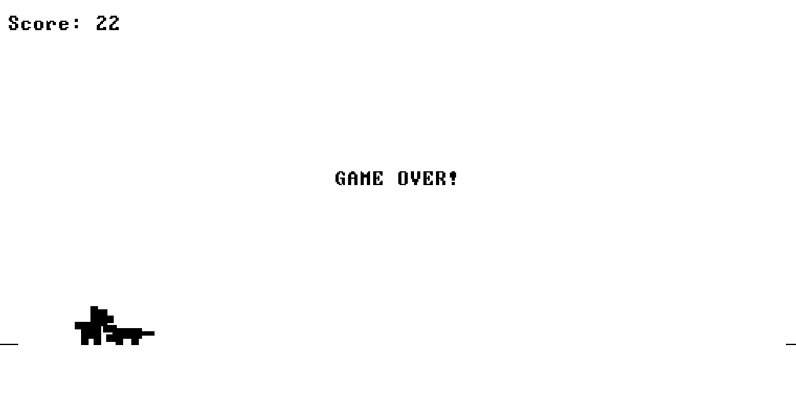

# 🐶 Dog Jump (Nand to Tetris - Proyecto 9)

Este es un juego desarrollado en el lenguaje **Jack** para la plataforma de hardware Hack, como parte de la materia de Organización de Computadores. 

Es un juego de supervivencia lateral tipo "Endless Runner" donde controlas a un perrito que debe saltar para esquivar cocodrilos. El proyecto demuestra el uso de programación orientada a objetos en Jack, manejo de memoria, gráficos por bloques y lectura de periféricos (teclado).

## 🚀 Cómo jugar

Dado que el juego está escrito en Jack, necesita compilarse a código de Máquina Virtual (.vm) y ejecutarse en el emulador oficial del curso Nand to Tetris.

### Requisitos previos
1. Descargar las herramientas oficiales del curso [Nand to Tetris](https://www.nand2tetris.org/software).
2. Tener el `JackCompiler` y el `VMEmulator` listos para usar.

### Ejecución
1. Compila la carpeta completa del proyecto usando el `JackCompiler`.
2. Abre el `VMEmulator`.
3. Haz clic en el ícono de "Load Program" 📂 y selecciona la **carpeta completa** de este proyecto.
4. **⚠️ MUY IMPORTANTE:** En las opciones del emulador, desactiva las animaciones (`No animation`) y pon la velocidad al máximo (`Fast`).
5. Dale al botón de ejecución rápida (⏩).

## 🎮 Controles
*   **Barra Espaciadora:** Saltar.
*   **Tecla 'Q':** Salir del juego.

## 🏗️ Arquitectura del Código

El juego está dividido en 4 clases principales para separar las responsabilidades:

*   `Main.jack`: Punto de entrada del programa. Inicializa el juego y limpia la memoria al terminar.
*   `DinoGame.jack`: Es el motor principal. Maneja el bucle infinito (Game Loop), la puntuación, dibuja la interfaz y calcula las colisiones.
*   `Dino.jack`: Controla al jugador (el perrito). Contiene las físicas simuladas de gravedad, la fuerza del salto y las coordenadas de dibujo de la figura.
*   `Obstacle.jack`: Controla al enemigo (el cocodrilo). Maneja su movimiento lateral y su reaparición en la pantalla.

## 🛠️ Tecnologías
*   **Lenguaje:** Jack (Alto nivel, orientado a objetos).
*   **Plataforma:** Hack Virtual Machine.

  
